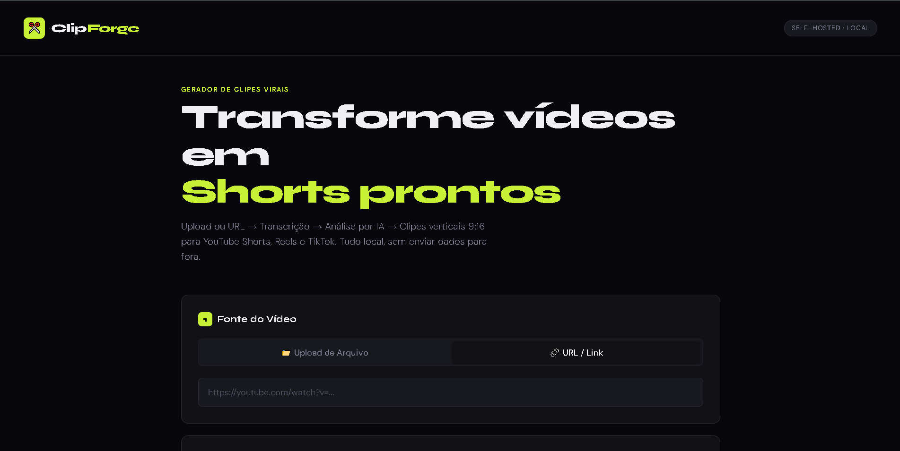
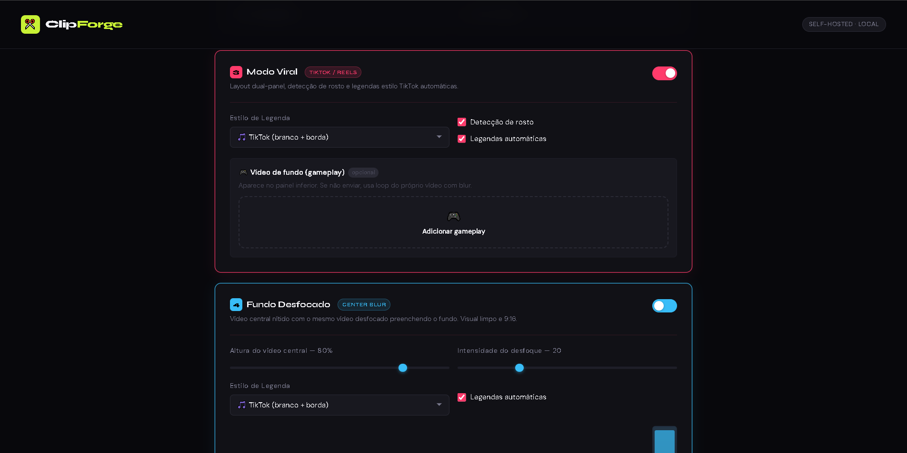
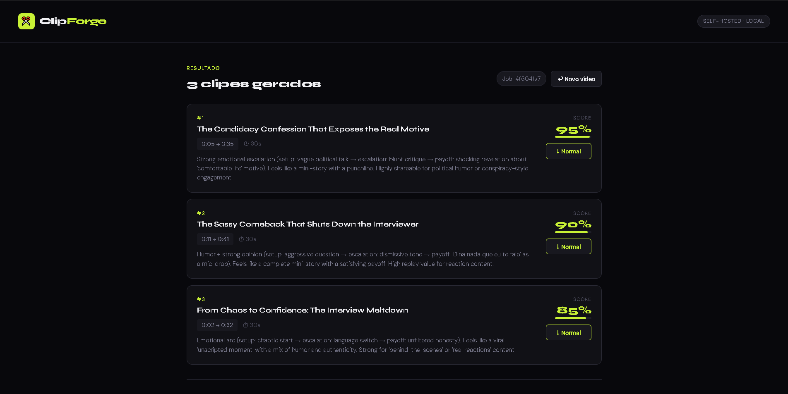

# ✂️ ClipForge — Gerador Local de Clipes Virais

Alternativa self-hosted ao Opus Clip. Analisa vídeos com IA, detecta os melhores trechos e exporta clipes verticais 9:16 prontos para Shorts, Reels e TikTok.



---

## 🏗 Estrutura do Projeto

```
clipforge/
├── .env                     ← Suas configurações (criar a partir do .env.example)
├── .env.example
├── README.md
├── backend/
│   ├── main.py              ← API FastAPI
│   ├── config.py            ← Carrega variáveis do .env
│   ├── models.py            ← Modelos Pydantic
│   ├── transcription.py     ← Camada unificada de transcrição
│   ├── center_blur.py     ← Opção para o modo de blur
│   ├── viral_edit.py     ← Opção para o modo de "Video Viral"
│   ├── analysis.py          ← Camada unificada de análise com IA
│   ├── video_processor.py   ← Operações FFmpeg + yt-dlp
│   ├── requirements.txt
│   ├── uploads/             ← Criado automaticamente
│   └── outputs/             ← Criado automaticamente (clipes finais)
└── frontend/
    ├── package.json
    ├── vite.config.js
    ├── index.html
    └── src/
        ├── main.jsx
        ├── App.jsx
        ├── App.css
        └── components/
            ├── UploadForm.jsx
            ├── StatusPanel.jsx
            └── ClipCard.jsx
```

---

## ⚙️ Pré-requisitos

| Dependência | Versão mínima | Instalação          |
|-------------|--------------|---------------------|
| Python      | 3.10+        | python.org          |
| Node.js     | 18+          | nodejs.org          |
| FFmpeg      | 6+           | ver abaixo          |
| yt-dlp      | qualquer     | ver abaixo          |

### Instalando FFmpeg

**macOS:**
```bash
brew install ffmpeg
```

**Ubuntu/Debian:**
```bash
sudo apt update && sudo apt install ffmpeg
```

**Windows:**
```
winget install Gyan.FFmpeg
```

### Instalando yt-dlp

```bash
pip install yt-dlp
# ou
brew install yt-dlp  # macOS
```

---

## 🚀 Instalação

### 1. Clone e configure

```bash
git clone <repo>
cd clipforge
cp .env.example .env
# Edite o .env com seus provedores e chaves de API
```

### 2. Backend

```bash
cd backend
python -m venv venv
source venv/bin/activate       # Windows: venv\Scripts\activate
pip install -r requirements.txt
```

> ⚠️ `faster-whisper` baixa o modelo na primeira execução. O modelo `base` (~150MB) é baixado automaticamente.

> A criação do venv pode ser opicional

### 3. Frontend

```bash
cd frontend
npm install
```

---

## ▶️ Execução

### Terminal 1 — Backend
```bash
cd backend
uvicorn main:app --reload --host 0.0.0.0 --port 8000
```

### Terminal 2 — Frontend
```bash
cd frontend
npm run dev
```

Acesse: **http://localhost:5173**

---

## 🔧 Configuração (.env)

```env
# ── Transcrição ──────────────────────────────────
TRANSCRIPTION_PROVIDER=whisper    # whisper | assemblyai
WHISPER_MODEL=base                # tiny | base | small | medium | large
ASSEMBLYAI_API_KEY=               # necessário se usar assemblyai

# ── Análise de IA ─────────────────────────────────
LLM_PROVIDER=ollama               # ollama | gemini | openrouter
GEMINI_API_KEY=                   # necessário se usar gemini
OLLAMA_BASE_URL=http://localhost:11434
OLLAMA_MODEL=llama3
OPENROUTER_API_KEY=               # necessário se usar openrouter
OPENROUTER_MODEL=mistralai/mistral-7b-instruct

# ── Geração de Clipes ──────────────────────────────
MAX_CLIPS=5
MIN_CLIP_SECONDS=15
MAX_CLIP_SECONDS=60
OUTPUT_FORMAT=mp4
OUTPUT_ASPECT_RATIO=9:16

# ─── Viral Edit ────────────────────────────────────────────────────────────────
ENABLE_VIRAL_EDIT=false # Ativar modo viral automaticamente (pode ser sobrescrito por clipe)

FACE_DETECTION=true # Usar OpenCV para detectar rosto e centralizar no painel superior


ADD_CAPTIONS=true # Queimar legendas estilo TikTok no vídeo

# Estilo das legendas: tiktok (branco+borda) | bold (amarelo uppercase)

CAPTION_STYLE=tiktok

# Caminho para um vídeo de gameplay/fundo (painel inferior)
# Se vazio, usa loop do próprio vídeo com blur
BACKGROUND_VIDEO_PATH=

# Caminho para uma fonte TTF personalizada
# Se vazio, usa Arial do sistema
FONT_PATH=

# ─── Center Blur Layout ────────────────────────────────────────────────────────
# Ativar por padrão (pode ser sobrescrito por clipe via frontend)
ENABLE_CENTER_BLUR_LAYOUT=false

# Proporção da altura ocupada pelo vídeo central (0.40 a 0.90)
CENTER_VIDEO_HEIGHT_RATIO=0.70

# Intensidade do desfoque no fundo (sigma do gblur, 5–60)
BACKGROUND_BLUR_STRENGTH=20

```
### Atenção

As configurações de Viral Edit e Center Blur podem ser editadas na hora de criar o Clip



> Se quiser alterar o fade que fica na transição dos videos no center_blur procure pela variavel VIGN

---

## 🔌 Configuração por Provedor

### Whisper (local, recomendado)
Sem configuração extra. O modelo é baixado automaticamente.
- `tiny` → mais rápido, menos preciso
- `base` → bom equilíbrio (padrão)
- `small` / `medium` → mais preciso, mais lento
- `large` → melhor qualidade, requer GPU

### Ollama (local)
1. Instale: https://ollama.com
2. Baixe um modelo: `ollama pull llama3`
3. Configure: `OLLAMA_MODEL=llama3`

### Gemini (API)
1. Crie chave em: https://aistudio.google.com
2. Configure: `GEMINI_API_KEY=sua_chave`

### AssemblyAI (API)
1. Crie conta em: https://assemblyai.com
2. Configure: `ASSEMBLYAI_API_KEY=sua_chave`

### OpenRouter (API)
1. Crie conta em: https://openrouter.ai
2. Configure: `OPENROUTER_API_KEY=sua_chave` e `OPENROUTER_MODEL=`

> O utilizamento do AssemblyAI está com alguns problemas de instabilidade a forma mais viavel seria no Whisper(Entretanto pode se utilizar o AssemblyAI)

> serve tambem a o OpenRouter(O Ollama tambem permite rodar modelos cloud é só pesquisa sobre o modelo que queria utilizar e ver se tem disponibilidade e colocar no OLLAMA_MODEL=)

---

## 🌊 Fluxo de Funcionamento

```
Usuário → Upload/URL
           ↓
     [yt-dlp download]  ← se URL
           ↓
     Extração de áudio (FFmpeg)
           ↓
     Transcrição (Whisper/AssemblyAI)
           ↓
     Análise com IA (Gemini/Ollama/OpenRouter)
           ↓
     Geração de clipes 9:16 (FFmpeg + blur de fundo)
           ↓
     Download pelo usuário
```

> Os resultados podem ser demorados

---

## 📡 API Endpoints

| Método | Endpoint                        | Descrição                      |
|--------|---------------------------------|--------------------------------|
| GET    | `/api/health`                   | Status do servidor             |
| POST   | `/api/upload`                   | Upload de arquivo de vídeo     |
| POST   | `/api/upload-url`               | Download de URL                |
| POST   | `/api/analyze/{job_id}`         | Inicia pipeline de análise     |
| GET    | `/api/status/{job_id}`          | Progresso do job               |
| GET    | `/api/clips/{job_id}`           | Lista de clipes gerados        |
| GET    | `/api/download/{job_id}/{file}` | Download de clipe              |
| DELETE | `/api/jobs/{job_id}`            | Remove job e arquivos          |
| GET    | `/api/config`                   | Configuração ativa             |

Documentação interativa: **http://localhost:8000/docs**

---

## 🐛 Solução de Problemas

**`faster-whisper` não instala:**
```bash
pip install faster-whisper --extra-index-url https://download.pytorch.org/whl/cpu
```

**FFmpeg não encontrado:**
```bash
which ffmpeg  # deve retornar um caminho
ffmpeg -version
```

**Ollama não responde:**
```bash
ollama serve  # garante que o servidor está rodando
ollama list   # lista modelos instalados
```

**Clipes sem áudio:**
O vídeo fonte pode não ter áudio. O FFmpeg ignora silenciosamente streams ausentes.

**Erro de CORS:**
O backend já permite todas as origens. Se ainda houver erro, verifique se o backend está rodando na porta 8000.

---

## 📝 Exemplo de Uso via cURL

```bash
# 1. Upload de arquivo
curl -X POST http://localhost:8000/api/upload \
  -F "file=@/path/to/video.mp4"
# → {"job_id": "abc123...", ...}

# 2. Iniciar análise
curl -X POST http://localhost:8000/api/analyze/abc123 \
  -H "Content-Type: application/json" \
  -d '{"transcription_provider": "whisper", "llm_provider": "ollama"}'

# 3. Verificar status
curl http://localhost:8000/api/status/abc123

# 4. Listar clipes
curl http://localhost:8000/api/clips/abc123

# 5. Baixar clipe
curl -O http://localhost:8000/api/download/abc123/clip_01_Titulo.mp4
```

---

## Resultado Final



---

## Licença

[Licença GNU-GPLv3](LiCENSE)